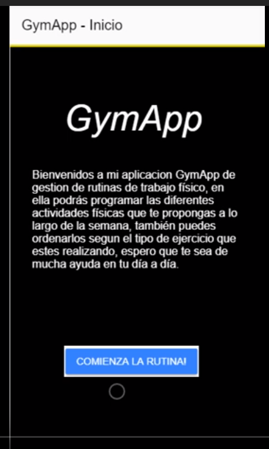
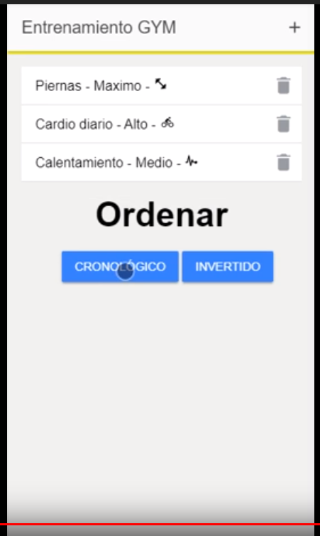
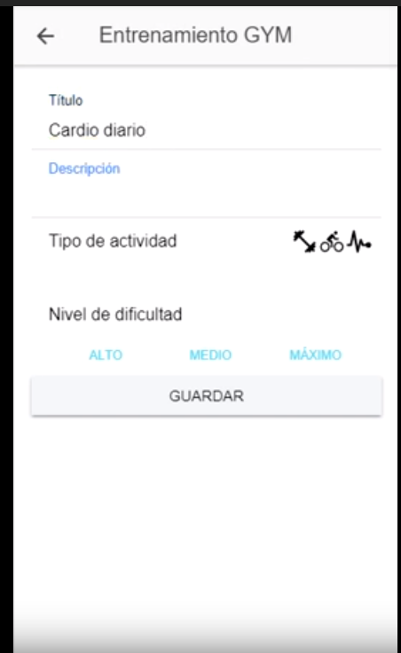
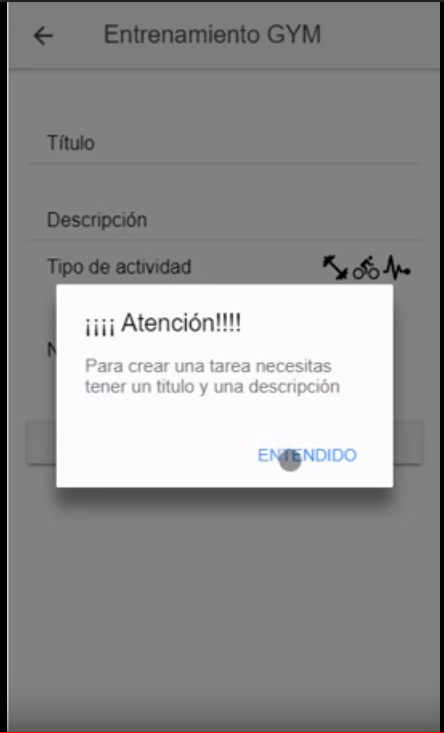

Bienvenidoa a mi nuevo repositorio en este encontraremos el proyecto de fin de asignatura el cual esta programado con <strong>Ionic 4</strong>, para la presentación usaré un video que he realizado probando las diferentes funcionalidades de esta aplicación. He generaado la apk para android por si algunos, si os interesa, quereis instalaros la aplicación en tu mocil y comenzar una vida más saludable. 
Mi aplicación se llama GymApp y trata de un gestor de actividades diario el cual nos permite tener un control de la actividad física que tenemos que hacer en el gimnasio. 
  Podeis encontrar el video demostracion en el siguiente enlace : https://youtu.be/e8sfgBaDfnk  

<h1> Capturas orientativas de la aplicación</h1>
</img>
</img>
</img>
</img>
